# The Impact of Membership Programs on Customer Growth & Revenue in Retail (YoY)


Author: Vo Thi Minh Van

Tools Used: SQL, BigQuery, Looker Studio

## Table of Contents

- [📋 Background & Overview](#-background--overview)
- [📋 Main Process](#-main-process)
- [💡Final Conclusion & Recommendations](#final-conclusion--recommendations)
## 📋 Background & Overview
### ❓ What is this project about?
This project analyzes the impact of membership programs on customer acquisition, customer retention, and revenue performance during the peak shopping season by comparing business data from December 2022 and December 2023.

The membership program includes two key promotional vouchers:
- **10% New Member** — available for newly registered members and can be used once only.
- **Birthday Discount Program** — available for registered members and can be used once per year during their birthday month.

The analysis combines:
- **YoY Analysis** to evaluate the overall effectiveness of the membership program between 2022 and 2023.
- **2023 Snapshot Analysis** to identify current promotion optimization opportunities and customer behavior patterns.
---
### 🎯 Business Problem & Objective
After implementing membership-related promotional campaigns, management teams needed a data-driven evaluation to determine whether the investment in membership programs generated sustainable business value and to identify existing operational issues for future optimization.

This project aims to:
- **Performance Overview**: Build an interactive dashboard to compare key business KPIs between December 2022 and December 2023.
- **Customer Segmentation**: Classify customers into three groups (New members, Old members, Non-members) to analyze revenue contribution and purchasing behavior.
- **Promotion Impact Analysis**: Measure the relationship between voucher usage and customer spending behavior, while identifying the most effective promotional campaigns.
- **Strategic Recommendation**: Provide actionable recommendations to optimize promotional budgets and improve customer retention strategies for future peak seasons.
---
### 👥 Who is this project for?
- Data Analysts
- Marketing Analysts
- Integrated Marketing Teams
- Business Intelligence Teams
---
### 📂 Dataset Description
**Data Source**: The dataset was collected and analyzed with permission from a company leading educational toy importer, distributor, and retailer in Vietnam.

To ensure data privacy, the dataset does not contain any personally identifiable customer information. Only transaction data for December 2022 and December 2023 and membership-related data were used to analyze purchasing behavior and membership program effectiveness.

---
### 🛠 Tech Stack Used
- **Google BigQuery** — data storage and large-scale data processing
- **SQL** — data querying, transformation, and aggregated table creation
- **Looker Studio** — dashboard visualization and business reporting

---
## 📋 Main Process
### 🔴 SQL Process
### A. Main Table
#### 1. Customer Dimension Table
Map unique customer identifiers and historical order lifecycle anchors to establish foundational cohort baselines. The purpose of this dimension table is to serve as the single source of truth for customer registration history and first purchase activity.

Since the raw dataset contains many guest transactions without Customer IDs, a surrogate ID system was created by combining the prefix `GUEST_` with the Invoice Number.

Additional data-cleaning steps were also applied to remove duplicated customer IDs from the raw dataset.

**🚀Queries**:
```sql
CREATE OR REPLACE TABLE `mktg-analysis-project.marketing_data.dim_customer_segment` AS
WITH all_unique_ids AS (
  SELECT 
  COALESCE(`Customer Number`, CONCAT('GUEST_',`Invoice Number`)) AS customer_id,
  `Customer Number` AS original_member_id,
  SAFE.PARSE_DATE('%m/%d/%Y', `Created date`) AS registration_date,
  Date AS order_date
  FROM `mktg-analysis-project.marketing_data.sales_data`
),

first_purchase AS (
  SELECT 
  customer_id,
  MIN (order_date) AS first_order_date,
  MIN (registration_date) AS registration_date,
  MAX(original_member_id) AS original_member_id
  FROM all_unique_ids
  GROUP BY 1
)

SELECT
  customer_id,
  registration_date,
  first_order_date,
  CASE
    WHEN original_member_id IS NULL THEN FALSE
    ELSE TRUE
  END AS is_member
FROM first_purchase;
```

**Result**:

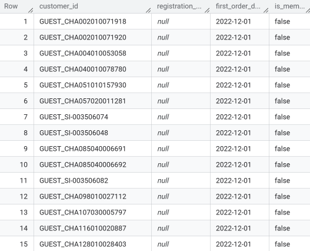
#### 2. Monthly Performance Fact Table
The purpose of this fact table is to create a highly optimized aggregated data model. By transforming complex transactional records into monthly-level summaries, the model significantly improves query performance and dashboard efficiency.

Dynamic labeling logic was applied to accurately classify customers as New Members, Old Members and Non-members based on their membership status at the exact transaction period, ensuring accurate YoY comparisons.

**🚀Query Snippet**:

```sql
CASE
      WHEN raw.`Promotion Name` IN ('10% new member', 'Birthday discount program') THEN 'Target Promotion'
      WHEN raw.`Promotion Name` IS NOT NULL THEN 'Other Promotion'
      ELSE 'No Promotion'
    END AS promo_category,

CASE 
      WHEN registration_date IS NULL THEN 'Non-member'
      WHEN EXTRACT(YEAR FROM registration_date) = year
        AND EXTRACT(MONTH FROM registration_date) = month THEN 'New member'
      WHEN registration_date < DATE(year,month,1) THEN 'Old member'
      ELSE 'Other'
    END AS dynamic_customer_type
```
**Result**:

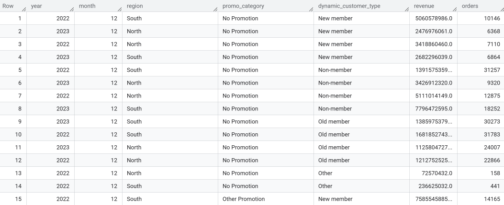
#### 3. Transaction-Level Fact Table
Record detailed line-item transactional data, including invoice IDs, promotion names, revenue values, and customer states.

The purpose of this granular fact table is to preserve a complete historical transaction ledger for advanced analytical use cases.  This provides provides the raw granular data necessary for deep-dive promotional and customer behavior analysis.

**🚀Queries**:

```sql
CREATE OR REPLACE TABLE `mktg-analysis-project.marketing_data.fact_transaction_details` AS
SELECT
  raw.Date AS order_date,
  raw.`Invoice Number` AS invoice_number,
  COALESCE(raw.`Customer Number`,CONCAT('GUEST_',raw.`Invoice Number`)) AS customer_id,
  raw.`Promotion Name` AS promotion_name,
  raw.Sell_Out_Amt AS revenue,
  
  CASE
    WHEN dim.registration_date IS NULL THEN 'Non-member'
    WHEN EXTRACT(YEAR FROM dim.registration_date) = raw.Year
      AND EXTRACT(MONTH FROM dim.registration_date) = raw.`Month Number` THEN 'New member'
    WHEN dim.registration_date < DATE(raw.Year,raw.`Month Number`,1) THEN 'Old member'
    ELSE 'Other'
  END AS dynamic_customer_type
FROM `mktg-analysis-project.marketing_data.sales_data` AS raw
LEFT JOIN `mktg-analysis-project.marketing_data.dim_customer_segment` AS dim
  ON COALESCE(raw.`Customer Number`,CONCAT('GUEST_',raw.`Invoice Number`)) = dim.customer_id
WHERE raw.`Promotion Name` IN ('10% new member', 'Birthday discount program');
```
**Result**:

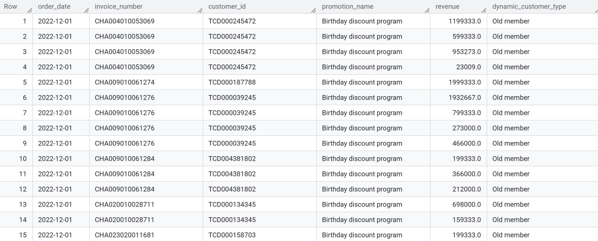
#### 4. Brand & Customer Performance Analysis
Calculate total revenue, total orders, and total units sold segmented by year, brand, and customer type.

The purpose of this analysis is to provide a detailed business performance breakdown across multiple operational dimensions:
- high-performing brands
- valuable customer groups
- regional performance differences
- effective marketing opportunities

The insights help support more targeted marketing and customer retention strategies.

**🚀Queries**:

```sql
CREATE OR REPLACE TABLE `mktg-analysis-project.marketing_data.brand_analysis` AS

WITH t AS (
  SELECT
    Year AS year, 
    `Month Number` AS month,
    Brand AS brand,
    SAFE.PARSE_DATE('%m/%d/%Y', `Created date`) AS registration_date,
    Sell_Out_Amt AS revenue,
    `Invoice Number` AS order_id,
    Sell_Out_Qty AS quantity,
FROM `mktg-analysis-project.marketing_data.sales_data`
), 

classified AS (
  SELECT
    year, brand,
     CASE 
      WHEN registration_date IS NULL THEN 'Non-member'
      WHEN EXTRACT(YEAR FROM registration_date) = year
        AND EXTRACT(MONTH FROM registration_date) = month THEN 'New member'
      WHEN registration_date < DATE(year,month,1) THEN 'Old member'
      ELSE 'Other'
    END AS dynamic_customer_type,
    order_id,
    revenue,
    quantity
  FROM t
)

SELECT
  year, brand, dynamic_customer_type,
  SUM(revenue) AS total_revenue, 
  COUNT(DISTINCT order_id) AS total_orders,
  SUM (quantity) AS total_units
FROM classified
GROUP BY year, brand, dynamic_customer_type;
```
**Result**:

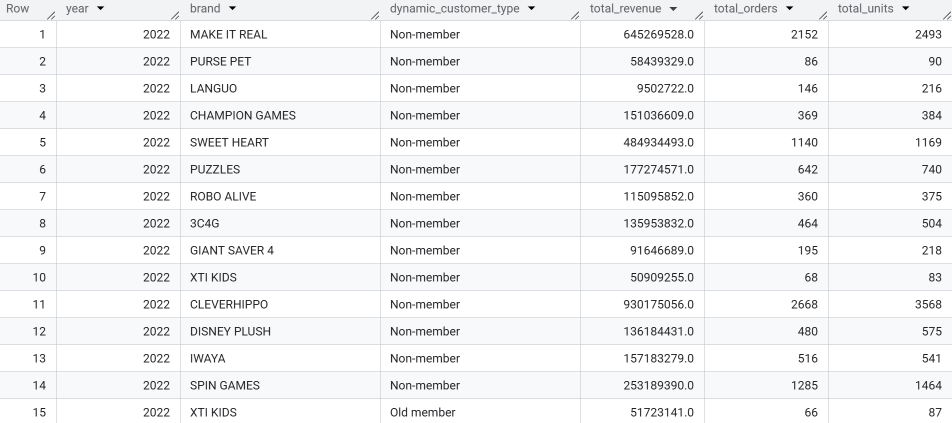
---
### B. Supplementary Calculations
#### 1. Calculate YoY revenue change drivers, including revenue loss from churn, gains from new members, and retained member variance.
This analysis explains the revenue change from December 2022 to December 2023 by separating key business drivers, including:
- revenue gained from new members
- revenue lost from customer churn
- revenue changes from retained customers

**🚀Query Snippet**:

```sql
SUM(IFNULL(revenue_2022,0)) AS revenue_dec_2022,

  SUM(
    CASE
      WHEN revenue_2022 IS NOT NULL
       AND revenue_2023 IS NULL
      THEN revenue_2022
      ELSE 0
    END
  ) AS revenue_loss,

  SUM(
    CASE
      WHEN revenue_2022 IS NULL
       AND revenue_2023 IS NOT NULL
       AND is_new_or_non_2023 = 1
      THEN revenue_2023
      ELSE 0
    END
  ) AS revenue_gain_from_new_members,

  SUM(
    CASE
      WHEN revenue_2022 IS NOT NULL
       AND revenue_2023 IS NOT NULL
      THEN revenue_2023 - revenue_2022
      ELSE 0
    END
  ) AS revenue_variance_retained_members
```

**Result**:

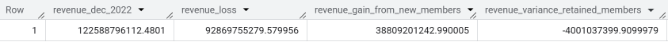
#### 2. Analyze customer loyalty conversion and birthday voucher reuse behavior from the 2022 cohort
This analysis evaluates customer retention from December 2022 to December 2023. It measures total returning customers and identifies key loyalty groups, including continuous birthday voucher users (“Birthday Loyalists”) and customers who did not reuse their birthday vouchers (“One-time Birthday Users”).

**🚀Query Snippet**:
```sql
SELECT
  COUNT(DISTINCT a.customer_id) AS total_customers_22,
  COUNT(DISTINCT b.customer_id) AS total_retained_customers,

  SUM(CASE
        WHEN a.used_birthday_22 = 1
         AND b.used_birthday_23 = 1
        THEN 1
      END) AS loyal_birthday_users,

  SUM(CASE
        WHEN a.used_birthday_22 = 1
         AND (b.used_birthday_23 = 0
              OR b.used_birthday_23 IS NULL)
        THEN 1
      END) AS non_reuse_birthday_users

FROM customers_22 a
LEFT JOIN customers_23 b
ON a.customer_id = b.customer_id
```

**Result**:

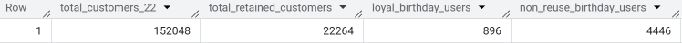

#### 3. Compare First-time vs Repeat Birthday Voucher Users in December 2023
This query segments birthday voucher users into two groups:
- first-time users in Dec 2023
- repeat users who redeemed birthday vouchers in both years

The analysis compares customer count, revenue contribution, and Average Order Value (AOV) to understand loyalty behavior and retention impact of the birthday promotion program.

**🚀Query Snippet**:
```sql
CASE
  WHEN b22.customer_id IS NOT NULL
  THEN 'Repeat Birthday Users'
  ELSE 'First-time Birthday Users'
END AS birthday_user_group

COUNT(DISTINCT f.customer_id) AS customers,
SUM(f.revenue) AS revenue,

SAFE_DIVIDE(
  SUM(f.revenue),
  COUNT(DISTINCT f.invoice_number)
) AS AOV
```

**Result:**

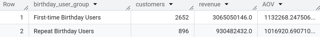


#### 4. Calculate same-day activation and dormancy rates for newly acquired members in December 2023
This analysis measures new member onboarding efficiency by identifying how many customers registered and used the “10% new member” voucher on the same day versus those who remained inactive. It helps evaluate early engagement and conversion effectiveness.

**🚀Query Snippet**:

```sql
dec_2023_members AS (
  SELECT DISTINCT
    customer_id,
    registration_date
  FROM t
  WHERE registration_date BETWEEN '2023-12-01' AND '2023-12-31'
),

same_day_usage AS (
  SELECT
    m.customer_id,
    MAX(CASE 
      WHEN b.promotion_name = '10% new member'
       AND b.order_date = m.registration_date
      THEN 1 ELSE 0
    END) AS used_same_day
  FROM dec_2023_members m
  LEFT JOIN t b ON m.customer_id = b.customer_id
  GROUP BY m.customer_id
)

SELECT
  COUNT(*) AS total_new_members_dec_2023,
  SUM(CASE WHEN used_same_day = 1 THEN 1 ELSE 0 END) AS same_day_users,
  SUM(CASE WHEN used_same_day = 0 THEN 1 ELSE 0 END) AS not_used_same_day_users,
FROM same_day_usage;
```
**Result:**

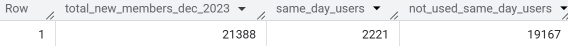

#### 5. Detect Promotion Abuse & Membership Policy Violations
This query detects suspicious promotion usage related to the “10% new member” and “Birthday discount program” vouchers. It identifies cases such as old members using new-member vouchers, late voucher usage, multiple redemptions, and non-members using member-only promotions to evaluate potential system loopholes and revenue leakage.

**🚀Query Snippet**:

```sql
SELECT
  * EXCEPT(usage_count),
  CASE
    WHEN dynamic_customer_type = 'Non-member'
      AND promotion_name = '10% new member'
    THEN 'Non-member Welcome Voucher Abuse'

     WHEN dynamic_customer_type = 'Non-member'
      AND promotion_name = 'Birthday discount program'
    THEN 'Non-member Birthday Voucher Abuse'

    WHEN promotion_name = '10% new member'
      AND days_since_registration > 15
    THEN 'Policy Violation: Late Welcome code'

    WHEN days_since_registration < 0
    THEN 'Used before registration'

    WHEN promotion_name = '10% new member'
      AND usage_count > 1
    THEN 'Policy Violation: Multiple Usage'

    ELSE 'Review Required'
  END AS fraud_reason
FROM check_logic
WHERE (dynamic_customer_type = 'Non-member' AND promotion_name IN ('10% new member', 'Birthday discount program'))
  OR (promotion_name = '10% new member' AND usage_count > 1)
  OR (promotion_name = '10% new member' AND days_since_registration > 15)
  OR (days_since_registration < 0)
```

**Result:**
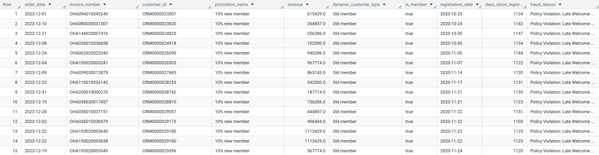


---
### 📊 Visualizations & Key Insights
### A. Dashboard Review
#### I. Executive Summary

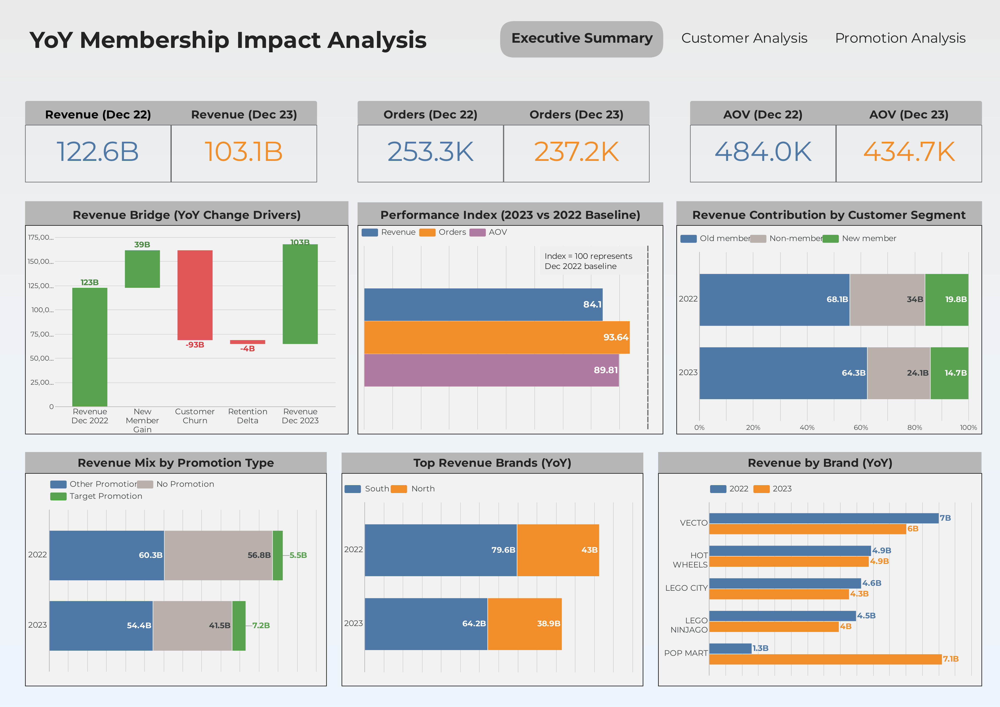
***🔑 Key Findings***:
#### 1. Revenue Declined YoY
Total revenue decreased from 122.6B (Dec 2022) to 103.1B (Dec 2023), down 15.9% YoY. Both total orders and AOV also declined.

→ Membership programs were not strong enough to offset the overall decline in customer purchasing behavior.
#### 2. Old Members Remained the Core Revenue Driver
Although total revenue declined, the contribution from Old Members increased from 55% to over 62% (68.1B → 64.3B).

→ The membership system still relies heavily on loyal customers rather than newly acquired members. This also shows that membership program helped stabilize revenue during market fluctuations.
#### 3. Positive Impact from New Members
New members generated 39B in revenue. While this is a positive contribution, it only recovered around 42% of the revenue lost from churned customers. In addition, the negative Retention Delta (-4B) shows that retained customers spent slightly less compared to last year.
#### 4. Declining AOV Reduced Order Quality
The Performance Index shows revenue (84.1) declined more sharply than orders (93.64), mainly due to lower AOV, which dropped from 484.0K to 434.7K (-10.2% YoY).

→ Customers were still purchasing, but spending less per order.
#### 5. Membership Promotions Contributed a Small Share of Revenue 
Most revenue still came from Other Promotions and No Promotion purchases. However, revenue from Target Promotions increased from 5.5B (Dec 2022) to 7.2B (Dec 2023), while No Promotion revenue declined significantly.

→ Membership vouchers have not become a major revenue driver yet, but they are effective in stimulating spending among target customers.
#### 6. South Region Consistently Led Revenue
The South region generated significantly higher revenue than the North in both years.

- South: 79.6B → 64.2B
- North: 43B → 38.9B

→ Despite YoY declines in both regions, the South remained the company’s primary revenue market.
#### 7. Brand Performance Shifted in 2023
Well-known brands such as Vecto declined, while Pop Mart experienced exceptional growth (1.3B → 7.1B).

→ Revenue became more concentrated in fast-growing brands, reflecting changing consumer preferences in 2023.

---
#### II. Customer Analysis

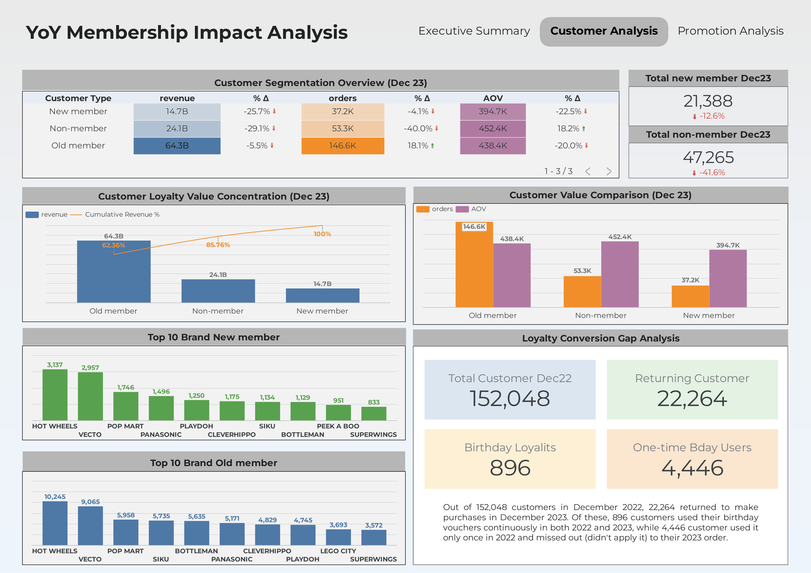
***🔑 Key Findings***:
#### 1. Old Members Remained the “Whale” Customer Group
Old Members contributed 62.36% of total revenue in Dec 2023 (64.3B). Although their revenue declined by -5.5% YoY, this was still the smallest drop compared to other groups (New Members: -25.7%, Non-members: -29.1%).

→ The membership program was more successful at building a loyal customer base that sustained business revenue rather than generating high-value new customers.
#### 2. Loyal Customers Drove Order Growth
Old Members were the only customer group with positive order growth, increasing +18.1% YoY to 146.6K orders.

In contrast, Non-members experienced a sharp decline (-41.6% in customer count and -40.0% in orders).

→ Membership programs helped retain loyal customers and encouraged repeat purchases to stabilize revenue.
#### 3. New Member Acquisition Became Weaker
Total new members in Dec 2023 reached 21,388, down 12.6% YoY.

Revenue from this group also declined to 14.7B, while AOV dropped sharply by 22.5%.

→ The membership program still attracted new registrations, but conversion quality and purchasing power weakened compared to Dec 2022.
#### 4. Declining AOV Became a Key Challenge
AOV declined significantly across both member groups. The only positive signal came from Non-members, whose AOV increased by +18.2% to 452.4K.

→ This group represents a strong conversion opportunity for future membership retention strategies.
#### 5. Retention & Loyalty Gaps Still Existed
From 152,048 customers in 2022, only 22,264 returned in 2023. Only 896 users redeemed birthday vouchers in both years.

→ Birthday campaigns supported retention, but their long-term loyalty impact remained limited.

Notably, 4,446 customers who previously used birthday vouchers did not return in 2023.

→ This is a high-potential customer segment for future personalized reactivation campaigns.
#### 6. Brand Preference Trends
Hot Wheels and Vecto were the top-performing brands among both new and old members.

→ These brands showed the strongest ability to drive membership-related purchasing behavior across the customer base.

---
#### III. Promotion Analysis

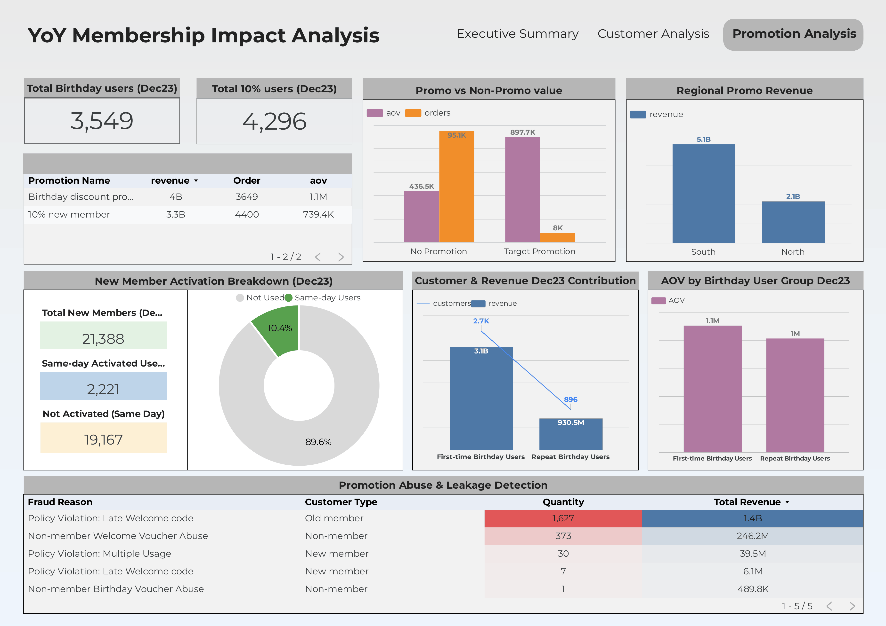

***🔑 Key Finding***:
#### 1. The 10% Voucher Successfully Attracted New Members
The “10% New Member” voucher attracted 4,296 users in Dec 2023, higher than the Birthday voucher in total users. However, only 10.4% of new members made a purchase on the registration day.

→ The membership program performed well in customer acquisition, but conversion into active buyers remained weak.

Notably, 89.6% of new members still had no first transaction after registration.

→ This represents a strong re-marketing opportunity for post-registration engagement campaigns.
#### 2. Birthday Voucher Generated Higher Spending Quality

Although the Birthday voucher had only 3,549 users, it delivered a much higher AOV (~1.1M) compared to the 10% voucher (739.4K).

→ The Birthday campaign was more effective at driving high-value purchases and engaging loyal customers.
#### 3. Birthday Users Showed Strong Loyalty Value

First-time Birthday users recorded the highest AOV (~1.1M).

Meanwhile, 896 repeat Birthday users maintained an AOV close to 1M per order.

→ Birthday benefits helped retain high-spending loyal customers with strong purchasing power.
#### 4. Promotion Revenue Was Concentrated in the South

The South region generated approximately 5.1B in promotion revenue, more than double the North (~2.1B).

→ Customers in the South responded more positively to membership and promotional campaigns.
#### 5. Promotion Abuse Created Revenue Leakage Risks

The system recorded approximately 1.4B in revenue leakage from late usage of Welcome vouchers by Old Members (1,627 cases). In addition, Non-members generated another 246.2M in leakage through unauthorized Welcome voucher usage.

→ Weak voucher control mechanisms may reduce promotion profitability and require stricter policy enforcement.

---
## 💡Final Conclusion & Recommendations
### 1. Conclusion
- **Membership Programs Became a Revenue Anchor**

Membership programs played an important role in supporting customer growth and revenue performance between Dec 2022 and Dec 2023. Although revenue, orders, and AOV all declined YoY, member customers remained the company’s core revenue source.

In particular, Old Members proved to be the strongest customer segment, contributing 62.36% of total revenue and becoming the only group with positive order growth (+18.1% YoY).

- **Promotion Effectiveness**

The “10% New Member” voucher performed well in attracting new customers and increasing acquisition traffic.

Meanwhile, the Birthday voucher generated higher-quality customers, delivering stronger AOV and more loyal purchasing behavior among repeat users.

- **Growth Quality Challenges**

The analysis also revealed a major conversion gap. Despite strong membership registrations, only around 10% of users made a purchase on the registration day. This indicates that onboarding and new-member activation strategies are still ineffective.

- **Operational Control Weaknesses**

Multiple voucher leakage cases created approximately 1.4B in revenue leakage from Old Members alone.

→ Weak voucher control mechanisms are directly reducing promotion profitability.

### 2. Strategic Recommendations

**Improve Early Member Activation**:

- Launch onboarding campaigns within the first 24 hours after registration
- Offer limited-time incentives for first purchases
- Trigger CRM reminders for inactive new members

**Focus on Loyalty-Based Promotions**:

- Prioritize personalized promotions over mass campaigns
- Build loyalty tiers for repeat customers
- Strengthen retention-focused engagement strategies

**Strengthen Voucher Control Systems**:

- Improve voucher validation logic
- Block non-members from accessing member-only promotions
- Monitor abnormal redemption behavior in real time

**Optimize Product Strategy by Customer Segment**:

- Focus on trending brands such as Pop Mart and Hot Wheels to attract new customers
- Use niche brands such as Siku and Bottleman as exclusive loyalty rewards for high-value members
